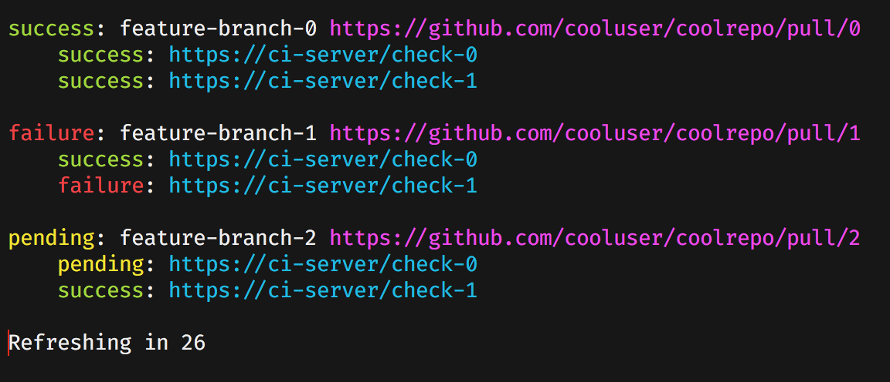

# watch-prs
_A simple Pull Request CI status monitor_

## Usage
To use this, just cd into a git repo and run
```
> watch-prs
```

This tool will pull down the statuses of all PRs you own and are assigned to.



## Installation and Setup
The install and setup process for this is janky. It should hopefully be improved soon.

### 1. **Install Go**

This requires go to be installed.

```
> brew install go
```

### 2. **Install This Tool**

```
> command go get github.com/juanrgon/watch-prs
```

### 3. **Add $HOME/go/bin to your PATH**

The executable for this is installed in `$HOME/go/bin`, so to use this tool and to quickly get updates, you'll want to add $HOME/go/bin to your command.

It is recommded to add this in your ~/.bashrc, ~/.bash_profile, or ~/.zshrc
```sh
export PATH=$HOME/go/bin:$PATH
```

### 4. **Create a Config File**
To access your PRs and their statuses, this tool will needs access to a github.com OAuth token with the **repo** scope. Currently, this is a very manual process that will hopefully be easier to setup in the future.

Below are step-by-step instructions on how to do this.

- a. Visit https://github.com/settings/tokens/new
- b. In the `Token Description` box, enter something like `watch-repos OAuth token for work laptop`; it should include `watch-repos` and a nickname for the computer that will use this tool
- c. Under `Select scopes`, check _only_ the **repo** checkbox, then hit the `Generate Token` button at the end of the page
- d. On the next page, copy the token that was created. If you forget to copy it, you'll have to go to back to step `a`
- e. Create the file `~/.config/watch-prs`, and enter the following text into it:
```json
{
 "github.com": {
    "user": "your github username goes here",
    "oauth_token": "the copied oauth token goes here"
 }
}
```
- f. For security, restrict the access privileges of this file by running `chmod 0600 ~/.config/watch-prs` in the terminal

## Uninstalling
```
command go clean -i github.com/juanrgon/watch-prs
```

## Common Errors
The error handling for this is a little janky. In the meantime, you can see the below to fix some common error messages. In the future, these should be automatically handled better.

#### Could not open config file
You need to create a `~/.config/watch-prs` file. Review https://github.com/juanrgon/watch-prs#create-a-config-file

#### Invalid JSON in config file /Users/juangonzalez/.config/watch-prs
Your config file most likely has a typo. Review https://github.com/juanrgon/watch-prs#create-a-config-file

### Error getting pull requests statuses from github
Most likely, you have entered the wrong github username or OAuth token in your config file.  Review https://github.com/juanrgon/watch-prs#create-a-config-file
